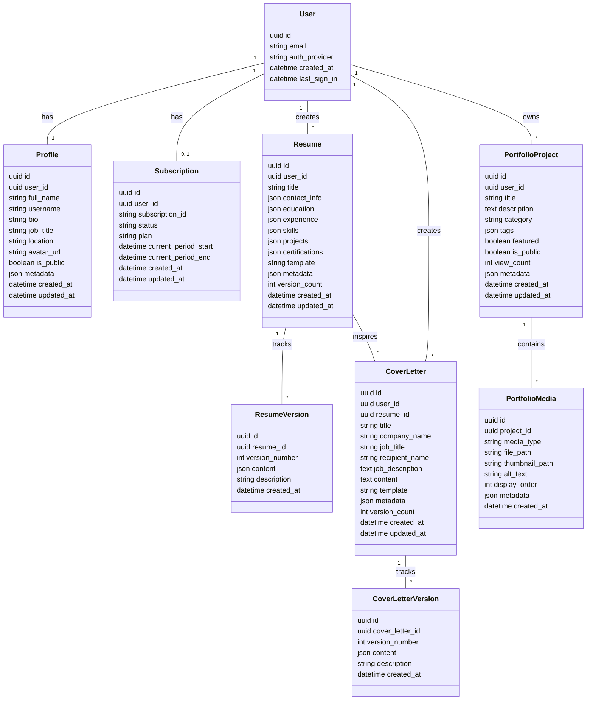
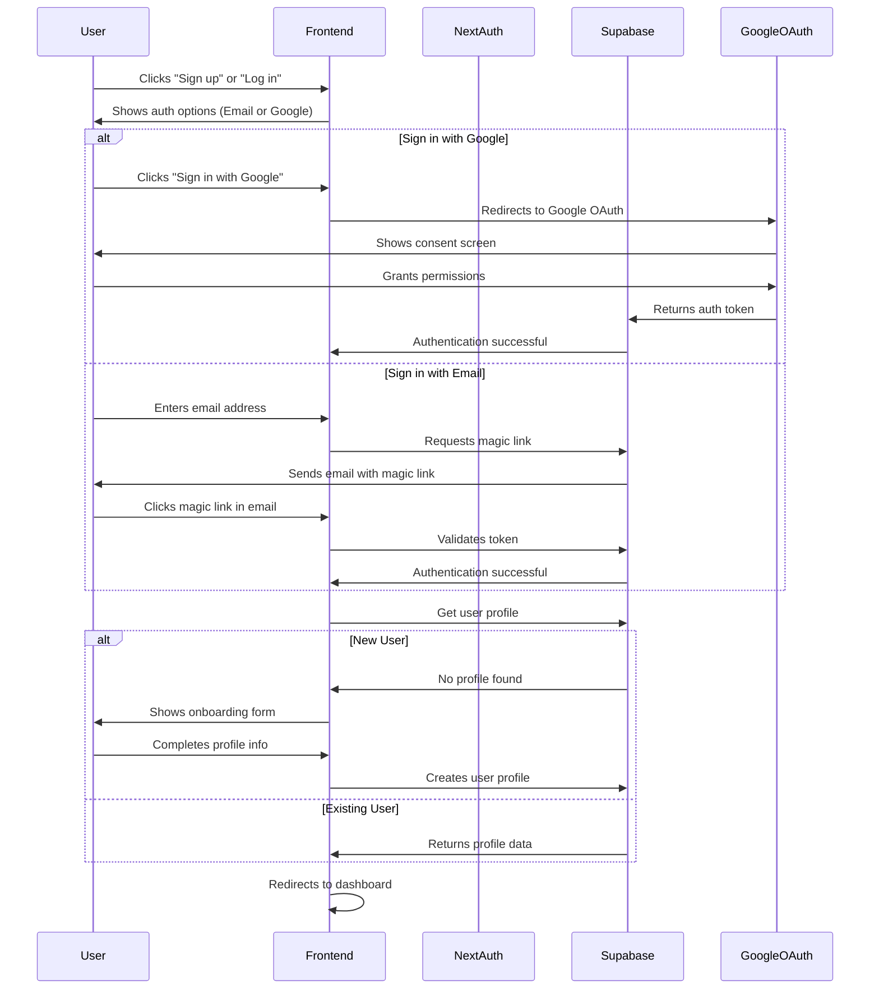
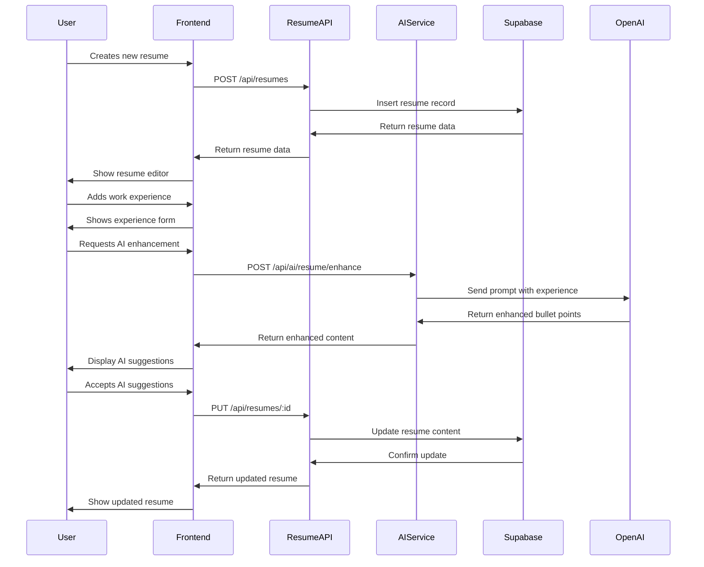
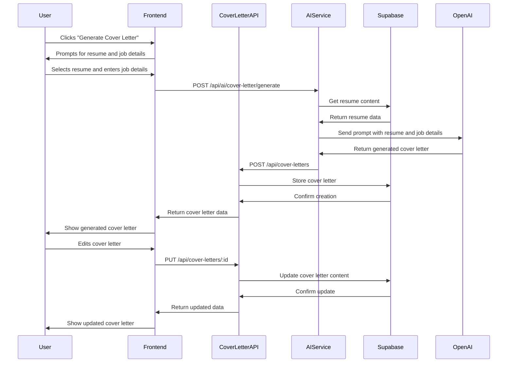
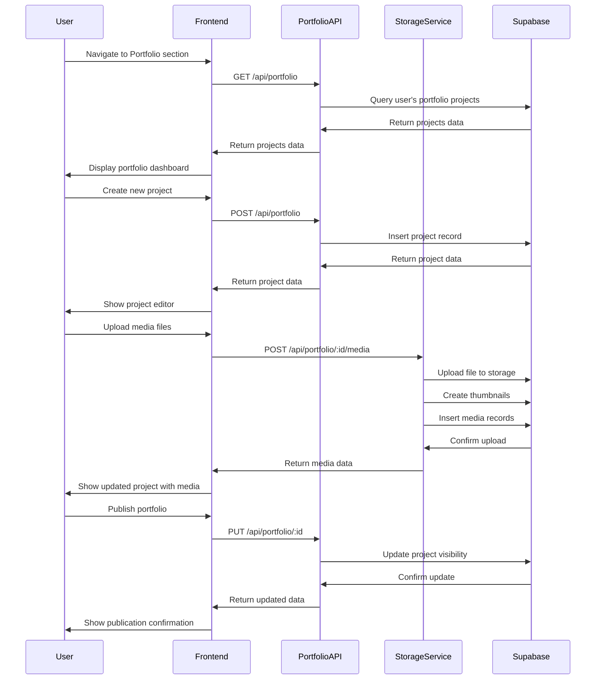
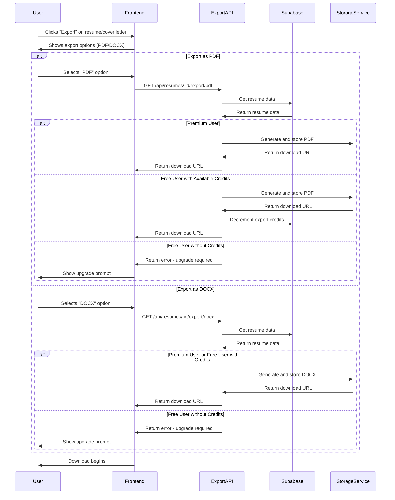
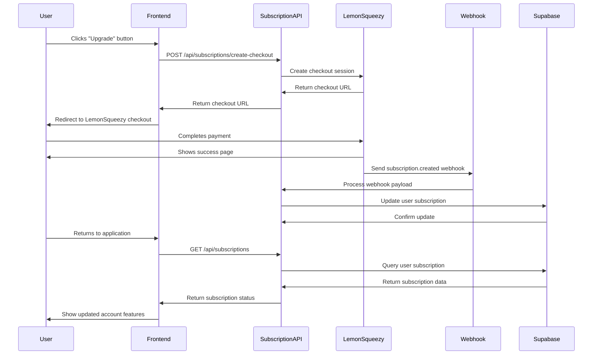
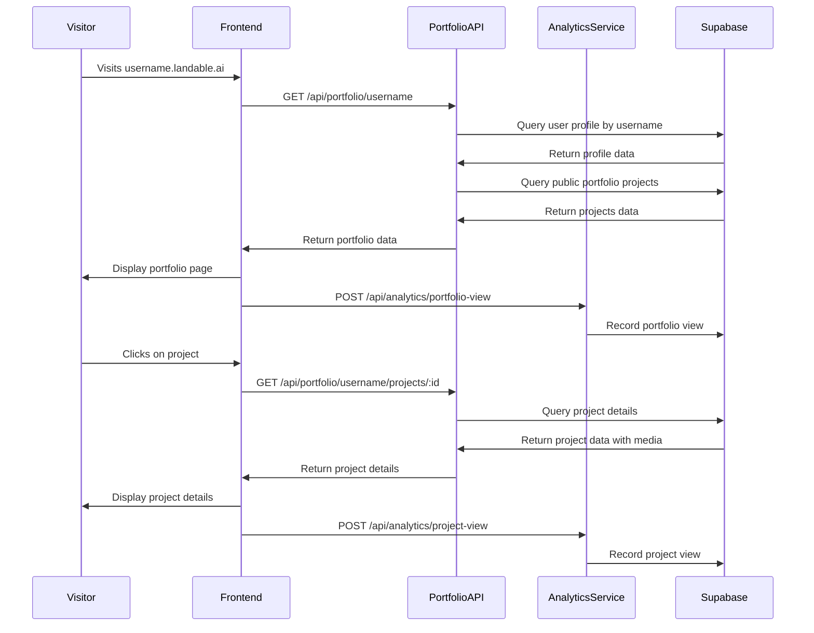

# Landed.io System Design

## Implementation approach

After analyzing the requirements for Landed.io, we'll build a modern web application that leverages the power of Next.js 14, Supabase, and AI integrations to create a comprehensive platform for job seekers. The system will be designed with a modular architecture that allows for phased development while maintaining a cohesive user experience.

### Key Technical Considerations

1. **ATS Optimization** - This is the core value proposition of our platform. We'll implement algorithms that analyze resume content against job descriptions to ensure maximum compatibility with Applicant Tracking Systems.

2. **AI Integration** - OpenAI's GPT-4 will be used to generate resume content and cover letters based on user input and job descriptions.

3. **Portfolio System** - A media-rich portfolio system will be implemented to showcase users' work with custom subdomains.

4. **Export Functionality** - High-quality document generation in multiple formats will be essential for the platform's success.

5. **Subscription Management** - A tiered feature access system will be implemented using LemonSqueezy for payment processing.

### Technology Stack Selection Rationale

| Technology | Selection Rationale |
|------------|---------------------|
| Next.js 14 | Server components for improved performance, app router for simplified routing, and API routes for backend functionality |
| TypeScript | Type safety to reduce bugs and improve developer experience |
| Tailwind CSS + ShadCN UI | Rapid UI development with consistent styling and accessibility |
| Supabase | Integrated authentication, database, and storage solution that simplifies backend development |
| OpenAI GPT-4 | State-of-the-art language model for high-quality content generation |
| LemonSqueezy | Developer-friendly payment processing with subscription management |
| Zustand + React Query | Lightweight state management paired with efficient server state handling |
| jsPDF + html2canvas | Client-side PDF generation for immediate document exports |

## Data structures and interfaces

### Database Schema

The following schema outlines the core data structures for the application:



### Core Service Interfaces

#### UserService

```typescript
interface UserService {
  getUserProfile(userId: string): Promise<Profile>;
  updateUserProfile(userId: string, profileData: Partial<Profile>): Promise<Profile>;
  checkUsernameAvailability(username: string): Promise<boolean>;
  getUserSubscriptionStatus(userId: string): Promise<SubscriptionStatus>;
}

type SubscriptionStatus = {
  plan: 'free' | 'monthly' | 'yearly';
  active: boolean;
  expiresAt?: Date;
  features: string[];
};
```

#### ResumeService

```typescript
interface ResumeService {
  getResumes(userId: string): Promise<Resume[]>;
  getResumeById(resumeId: string, userId: string): Promise<Resume>;
  createResume(resumeData: Partial<Resume>, userId: string): Promise<Resume>;
  updateResume(resumeId: string, resumeData: Partial<Resume>, userId: string): Promise<Resume>;
  deleteResume(resumeId: string, userId: string): Promise<boolean>;
  duplicateResume(resumeId: string, userId: string): Promise<Resume>;
  createResumeVersion(resumeId: string, description: string, userId: string): Promise<ResumeVersion>;
  getResumeVersions(resumeId: string, userId: string): Promise<ResumeVersion[]>;
}
```

#### CoverLetterService

```typescript
interface CoverLetterService {
  getCoverLetters(userId: string): Promise<CoverLetter[]>;
  getCoverLetterById(coverId: string, userId: string): Promise<CoverLetter>;
  createCoverLetter(coverData: Partial<CoverLetter>, userId: string): Promise<CoverLetter>;
  updateCoverLetter(coverId: string, coverData: Partial<CoverLetter>, userId: string): Promise<CoverLetter>;
  deleteCoverLetter(coverId: string, userId: string): Promise<boolean>;
  duplicateCoverLetter(coverId: string, userId: string): Promise<CoverLetter>;
  createCoverLetterVersion(coverId: string, description: string, userId: string): Promise<CoverLetterVersion>;
  getCoverLetterVersions(coverId: string, userId: string): Promise<CoverLetterVersion[]>;
}
```

#### AIService

```typescript
interface AIService {
  generateResumeBulletPoints(experience: string, jobDescription?: string): Promise<string[]>;
  enhanceResumeContent(resumeContent: string, jobDescription?: string): Promise<string>;
  analyzeCoverLetterQuality(coverLetter: string, resumeContent: string, jobDescription: string): Promise<AIFeedback>;
  generateCoverLetter(resumeData: Resume, jobDetails: JobDetails): Promise<string>;
  analyzeResumeForATS(resumeContent: string, jobDescription?: string): Promise<ATSAnalysis>;
  enhancePortfolioDescription(description: string, category: string): Promise<string>;
}

type JobDetails = {
  title: string;
  company: string;
  description: string;
  recipient?: string;
};

type AIFeedback = {
  score: number; // 0-100
  strengths: string[];
  weaknesses: string[];
  improvements: string[];
};

type ATSAnalysis = {
  score: number; // 0-100
  keywordMatches: { keyword: string, count: number }[];
  missingKeywords: string[];
  formatIssues: string[];
  recommendations: string[];
};
```

#### PortfolioService

```typescript
interface PortfolioService {
  getProjects(userId: string): Promise<PortfolioProject[]>;
  getProjectById(projectId: string, userId: string): Promise<PortfolioProject>;
  createProject(projectData: Partial<PortfolioProject>, userId: string): Promise<PortfolioProject>;
  updateProject(projectId: string, projectData: Partial<PortfolioProject>, userId: string): Promise<PortfolioProject>;
  deleteProject(projectId: string, userId: string): Promise<boolean>;
  getPublicPortfolio(username: string): Promise<{profile: Profile, projects: PortfolioProject[]}>;
  uploadMedia(projectId: string, file: File, metadata: Partial<PortfolioMedia>, userId: string): Promise<PortfolioMedia>;
  deleteMedia(mediaId: string, userId: string): Promise<boolean>;
  reorderMedia(projectId: string, mediaOrder: string[], userId: string): Promise<boolean>;
  recordPortfolioView(username: string, projectId?: string): Promise<void>;
}
```

#### ExportService

```typescript
interface ExportService {
  exportResumeToPDF(resumeId: string, userId: string, options?: ExportOptions): Promise<Blob>;
  exportResumeToDocx(resumeId: string, userId: string, options?: ExportOptions): Promise<Blob>;
  exportCoverLetterToPDF(coverId: string, userId: string, options?: ExportOptions): Promise<Blob>;
  exportCoverLetterToDocx(coverId: string, userId: string, options?: ExportOptions): Promise<Blob>;
  getPlainTextResume(resumeId: string, userId: string): Promise<string>;
  getShareableLink(documentId: string, documentType: 'resume' | 'cover-letter', userId: string): Promise<string>;
}

type ExportOptions = {
  template?: string;
  color?: string;
  fontSize?: 'small' | 'medium' | 'large';
  margins?: 'narrow' | 'normal' | 'wide';
  includePhoto?: boolean;
};
```

#### SubscriptionService

```typescript
interface SubscriptionService {
  createCheckoutSession(userId: string, plan: 'monthly' | 'yearly'): Promise<{ url: string, sessionId: string }>;
  handleSubscriptionWebhook(payload: any): Promise<void>;
  cancelSubscription(userId: string): Promise<boolean>;
  checkFeatureAccess(userId: string, feature: SubscriptionFeature): Promise<boolean>;
}

type SubscriptionFeature = 
  | 'unlimited_exports'
  | 'advanced_ai_generation'
  | 'unlimited_portfolio_projects'
  | 'version_history'
  | 'custom_domain';
```

## Program call flow

### User Registration and Authentication Flow



### Resume Creation and AI Enhancement Flow



### Cover Letter Generation Flow



### Portfolio Creation and Management Flow



### Export Document Flow



### Subscription Management Flow



### Portfolio Viewing Flow (Public)



## API Endpoints

### Authentication

- `POST /api/auth/signup` - Register new user
- `POST /api/auth/signin` - Sign in with email/password
- `POST /api/auth/magic-link` - Request magic link
- `POST /api/auth/google` - Sign in with Google
- `GET /api/auth/session` - Get current session
- `POST /api/auth/signout` - Sign out

### User Management

- `GET /api/user/profile` - Get user profile
- `PUT /api/user/profile` - Update user profile
- `GET /api/user/check-username/:username` - Check username availability
- `PUT /api/user/settings` - Update user settings

### Resume Management

- `GET /api/resumes` - List user's resumes
- `POST /api/resumes` - Create new resume
- `GET /api/resumes/:id` - Get resume by ID
- `PUT /api/resumes/:id` - Update resume
- `DELETE /api/resumes/:id` - Delete resume
- `POST /api/resumes/:id/duplicate` - Duplicate resume
- `GET /api/resumes/:id/versions` - Get resume versions
- `POST /api/resumes/:id/versions` - Create new version
- `GET /api/resumes/:id/export/:format` - Export resume (PDF/DOCX)

### Cover Letter Management

- `GET /api/cover-letters` - List user's cover letters
- `POST /api/cover-letters` - Create new cover letter
- `GET /api/cover-letters/:id` - Get cover letter by ID
- `PUT /api/cover-letters/:id` - Update cover letter
- `DELETE /api/cover-letters/:id` - Delete cover letter
- `POST /api/cover-letters/:id/duplicate` - Duplicate cover letter
- `GET /api/cover-letters/:id/versions` - Get cover letter versions
- `POST /api/cover-letters/:id/versions` - Create new version
- `GET /api/cover-letters/:id/export/:format` - Export cover letter (PDF/DOCX)

### AI Features

- `POST /api/ai/resume/bullet-points` - Generate resume bullet points
- `POST /api/ai/resume/enhance` - Enhance resume content
- `POST /api/ai/resume/ats-analysis` - Analyze resume for ATS compatibility
- `POST /api/ai/cover-letter/generate` - Generate cover letter from resume
- `POST /api/ai/cover-letter/analyze` - Analyze cover letter quality
- `POST /api/ai/job-description/analyze` - Extract key requirements from job description
- `POST /api/ai/portfolio/enhance-description` - Generate enhanced project description

### Portfolio Management

- `GET /api/portfolio` - List user's portfolio projects
- `POST /api/portfolio` - Create new portfolio project
- `GET /api/portfolio/:id` - Get project by ID
- `PUT /api/portfolio/:id` - Update portfolio project
- `DELETE /api/portfolio/:id` - Delete portfolio project
- `POST /api/portfolio/:id/media` - Upload media to project
- `DELETE /api/portfolio/:id/media/:mediaId` - Delete media
- `PUT /api/portfolio/:id/media/reorder` - Reorder media items
- `GET /api/portfolio/username/:username` - Get public portfolio by username
- `GET /api/portfolio/username/:username/projects/:id` - Get public project

### Subscription Management

- `GET /api/subscriptions` - Get user subscription status
- `POST /api/subscriptions/create-checkout` - Create checkout session
- `POST /api/subscriptions/cancel` - Cancel subscription
- `GET /api/subscriptions/features/:feature` - Check feature access

### Webhooks

- `POST /api/webhooks/lemonsqueezy` - Handle LemonSqueezy subscription events
- `POST /api/webhooks/supabase` - Handle Supabase events (if needed)

## Security Considerations

### Authentication Security

1. **JWT Token Security**
   - Short expiration times (1 hour)
   - Secure, HTTP-only cookies for token storage
   - CSRF protection for all authenticated requests

2. **Magic Links**
   - Limited validity period (10 minutes)
   - One-time use only
   - Rate limiting to prevent abuse

3. **OAuth Security**
   - Proper validation of OAuth tokens
   - Secure storage of client secrets
   - State parameter validation to prevent CSRF

### Data Security

1. **Database Security**
   - Row-level security (RLS) policies in Supabase:
     ```sql
     CREATE POLICY "Users can only access their own resumes"
     ON resumes FOR ALL
     USING (auth.uid() = user_id);
     ```
   - Prepared statements for all database queries
   - Input validation for all user-provided data

2. **API Security**
   - Rate limiting for all API endpoints
   - Proper authentication middleware on protected routes
   - Validation of all input data using Zod or similar

3. **File Upload Security**
   - File type validation
   - Virus scanning for uploaded files
   - File size limitations
   - Secure file storage with proper access controls
   - Image processing to remove metadata and potential embedded code

### Payment Security

1. **LemonSqueezy Integration**
   - Use of LemonSqueezy's secure checkout process
   - Webhook signature validation
   - No storing of payment details on our servers

### Portfolio Security

1. **Custom Domain Security**
   - Proper subdomain isolation
   - Content Security Policy (CSP) headers
   - XSS protection for user-provided content

2. **Content Moderation**
   - Automated scanning of uploaded content
   - Reporting mechanism for inappropriate content
   - Manual review process for flagged content

## Anything UNCLEAR

1. **Specific AI Prompt Engineering** - The exact prompts for GPT-4 to generate high-quality resumes and cover letters will require extensive testing and refinement based on user feedback.

2. **Portfolio Media Storage Limits** - We need to define storage limits for free vs. paid users to manage costs (e.g., number of projects, file size limits).

3. **ATS Optimization Algorithm** - The specific algorithm for analyzing and optimizing resume content for ATS will need to be developed and refined over time.

4. **Detailed Export Templates** - The specific design and layout of resume and cover letter templates will require professional design work.

5. **Analytics Requirements** - The specific analytics needed for portfolio views and document performance tracking should be further defined.

6. **Backup and Recovery Strategy** - A comprehensive backup strategy for user data needs to be established.